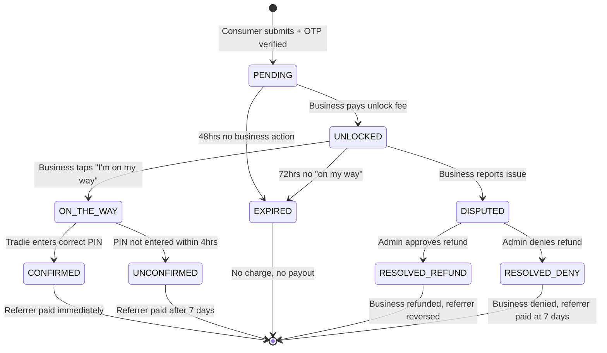
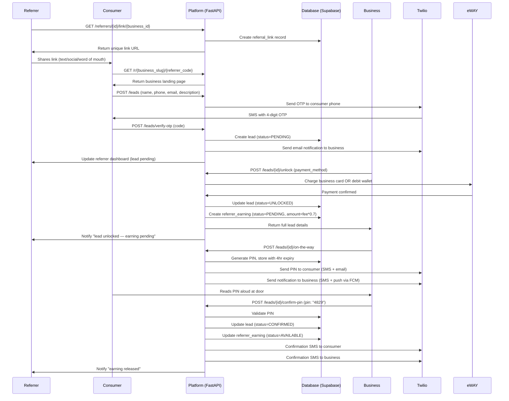

# 02 — User Flows

This document covers every user journey from first visit to completed action. Read this before building any screen.

---

## Flow 1: Business Signup

A tradie hears about TradeRefer and signs up.

```
┌─────────────────────────────────────────────────────────┐
│                  BUSINESS SIGNUP FLOW                   │
└─────────────────────────────────────────────────────────┘

Business visits traderefer.com.au
           │
           ▼
Lands on homepage
Sees: "Get leads from people who know you. Pay only when they arrive."
Clicks: [Sign Up Free — No Credit Card]
           │
           ▼
Signup Page
Fields:
  - Full name
  - Business name
  - Email address
  - Password
  - Mobile number
  - State/suburb
Clicks: [Create Account]
           │
           ▼
Email verification sent via SMTPtoGo
"Verify your email to activate your listing"
           │
           ▼
Business verifies email (clicks link)
           │
           ▼
Profile Setup (Step 1 of 3)
"Tell us about your business"
Fields:
  - Trade category (dropdown: Plumber, Electrician, Builder, etc.)
  - Suburb (Google Maps autocomplete)
  - ABN (optional at this stage, required before first payout)
  - Business description (max 300 chars)
  - Business phone number
  - Website (optional)
Clicks: [Next]
           │
           ▼
Profile Setup (Step 2 of 3)
"Set your lead price"
Fields:
  - Unlock fee: [$___] (slider: $3 min – $20 max)
  - "What makes a good lead for you?" (text area, shown to referrers)
  - Service area radius (5km / 10km / 20km / 50km)
Explanation shown: "Referrers earn 70% of your unlock fee. You keep all the lead info."
Clicks: [Next]
           │
           ▼
Profile Setup (Step 3 of 3)
"Upload photos (optional)"
  - Business logo
  - Example work photos (up to 5)
Clicks: [Finish Setup — Go Live]
           │
           ▼
✅ Business is now LIVE in the directory
Dashboard shown with:
  - "Your listing is live!"
  - "Share your profile link to start getting referrals"
  - Leads inbox (empty, with explanation)
  - Wallet balance: $0.00
```

---

## Flow 2: Referrer Signup

Someone wants to earn by referring leads.

```
┌─────────────────────────────────────────────────────────┐
│                  REFERRER SIGNUP FLOW                   │
└─────────────────────────────────────────────────────────┘

Referrer visits traderefer.com.au
           │
           ▼
Lands on homepage
Sees: "Know a good tradie? Earn money every time you send them a lead."
Clicks: [Earn As A Referrer]
           │
           ▼
Referrer Signup Page
Fields:
  - Full name
  - Email address
  - Password
  - Mobile number
Clicks: [Create Account]
           │
           ▼
Email verification sent
           │
           ▼
Email verified
           │
           ▼
Referrer Dashboard — Welcome Screen
"Browse businesses and grab your referral link"
  - Search bar: [suburb or trade type]
  - Directory of businesses listed
           │
           ▼
Referrer finds a business they know/trust
Clicks: [Get My Referral Link]
           │
           ▼
Unique link generated:
traderefer.com.au/r/bobs-plumbing/abc123xyz
           │
           ▼
Share options shown:
  - [Copy Link]
  - [Share via SMS]
  - [Share via WhatsApp]
  - Pre-written caption: "Need a plumber? Bob's done great work for me — get a quote here: [link]"
           │
           ▼
Referrer shares link — done
```

---

## Flow 3: Consumer Submits a Lead

Someone clicks a referrer's link and submits an enquiry.

```
┌─────────────────────────────────────────────────────────┐
│                   LEAD SUBMISSION FLOW                  │
└─────────────────────────────────────────────────────────┘

Consumer clicks referrer's link
traderefer.com.au/r/bobs-plumbing/abc123xyz
           │
           ▼
Business Landing Page loads
Shows:
  - Business name and logo
  - Trade category and suburb
  - Business description
  - Photos (if uploaded)
  - "What to expect" (response time, service area)
  - Review/connection rate badge
           │
           ▼
Lead Form (below the fold or in a modal)
"Get a free quote from Bob's Plumbing"
Fields:
  - Your name (required)
  - Your mobile number (required)
  - Your email (required)
  - Your suburb (required)
  - What do you need? (text area, required, min 20 chars)
Disclaimer: "Your details will be shared with Bob's Plumbing only."
Privacy Policy link shown.
Clicks: [Send My Enquiry]
           │
           ▼
SYSTEM CHECKS (invisible to user)
  1. Is mobile number already used for this business? → If yes: "You've already submitted to this business"
  2. Is this IP flagged for velocity? → If yes: silently log for review
  3. Does business have active listing? → If no: show error
           │
           ▼
Phone Verification Step
"We sent a 4-digit code to 0412 XXX XXX"
"Enter it below to confirm your enquiry"
[_] [_] [_] [_]
[Resend code] (available after 30 seconds)
           │
           ▼
Consumer enters correct OTP
           │
           ▼
✅ Lead created in database (status: PENDING)
           │
           ▼
Consumer sees confirmation screen:
"Enquiry sent to Bob's Plumbing! ✅
You'll hear from them soon. We'll send you a text
when they're on their way."
No login required — consumer is done.
           │
           ▼
SYSTEM fires simultaneously:
  → Business email: "You have a new lead waiting"
  → Referrer notification (in-app): "New lead from your link — pending unlock"
```

---

## Flow 4: Business Unlocks a Lead

Business receives a lead notification and pays to unlock it.

```
┌─────────────────────────────────────────────────────────┐
│                   LEAD UNLOCK FLOW                      │
└─────────────────────────────────────────────────────────┘

Business receives email:
Subject: "🔔 New lead waiting — Bob's Plumbing"
Body: "Someone in Geelong needs a plumber.
       Suburb: Newtown
       Job type: Burst pipe
       Unlock this lead for $8.00 →"
[Unlock This Lead] button
           │
           ▼
Business clicks link → taken to their dashboard
(or already in dashboard → sees notification badge)
           │
           ▼
Leads Inbox — Lead Preview Card
Shows (BLURRED/HIDDEN):
  ✅ Suburb: Newtown
  ✅ Job description: "Burst pipe in bathroom, urgent"
  ✅ Submitted: 23 minutes ago
  ❌ Name: ████████ (hidden)
  ❌ Phone: ████████ (hidden)
  ❌ Email: ████████ (hidden)

Banner: "Unlock this lead for $8.00"
[PAY $8.00 TO UNLOCK]  [Not interested]
           │
           ▼
Business clicks [PAY $8.00 TO UNLOCK]
           │
           ▼
Payment Modal appears
Option A — Pay as you go:
  Card number: [________________]
  Expiry: [__/__]  CVC: [___]
  [Pay $8.00 Now]

Option B — Use wallet credit:
  Wallet balance: $24.50
  [Unlock using $8.00 credit]

Option C — Load wallet + get bonus:
  "Load $50 → get $55 credit (10% bonus)"
  [Load Wallet Instead]
           │
           ▼
Payment processed via eWAY
           │
           ▼
✅ Lead UNLOCKED — full details revealed:
  Name: Sarah Thompson
  Phone: 0412 345 678
  Email: sarah@email.com
  Suburb: Newtown
  Job: "Burst pipe in bathroom behind toilet, urgent, water is off"

Actions shown:
  [Call Sarah Now]  [SMS Sarah]  [I'm On My Way →]

Timer shown: "Contact within 48hrs to maintain your response rating ⏱"
           │
           ▼
SYSTEM updates:
  → Lead status: UNLOCKED
  → Referrer earnings: moved to PENDING
  → Business wallet: debited $8.00 (or card charged)
  → Referrer notified: "Your lead was unlocked! $5.60 pending"
```

---

## Flow 5: The PIN Confirmation ("I'm On My Way")

The core trust mechanic. Business taps "I'm on my way" — this is the trigger.

```
┌─────────────────────────────────────────────────────────┐
│              PIN CONFIRMATION FLOW                      │
└─────────────────────────────────────────────────────────┘

Business is about to leave for the job
Opens their dashboard or mobile app
Finds the lead → clicks [I'm On My Way]
           │
           ▼
SYSTEM generates 4-digit PIN (e.g. 4829)
Stores it against the lead with 4-hour expiry
           │
           ▼
SIMULTANEOUS — fires to both parties:

TO CONSUMER (SMS):                    TO TRADIE (SMS + Push notification):
────────────────────                  ────────────────────────────────────
"Hi Sarah! Bob's Plumbing            "You're heading to Sarah in
is on their way to you.              Newtown for a burst pipe job.
Your connection code is              Ask them for their 4-digit
4829. Share this with                connection code when you
Bob when they arrive.                arrive and enter it in the app.
- TradeRefer"                        - TradeRefer"

           │
           ▼
Tradie arrives at consumer's home
Consumer opens their SMS
Reads out: "4829"
           │
           ▼
Tradie opens TradeRefer app
PIN Entry Screen:
┌─────────────────────────┐
│  Confirm visit with     │
│  Sarah in Newtown       │
│                         │
│  Enter their code:      │
│  [4] [8] [2] [9]        │
│                         │
│  [CONFIRM VISIT ✓]      │
│                         │
│  ⏱ Expires in 3:42:18   │
└─────────────────────────┘
           │
           ▼
Tradie taps [CONFIRM VISIT]
           │
           ▼
SYSTEM validates PIN
           │
     ──────┴──────
     │            │
  MATCH        NO MATCH
     │            │
     ▼            ▼
✅ Connection   Error shown:
confirmed      "Code incorrect.
               Ask Sarah to
               check their SMS."
               (3 attempts max)
           │
           ▼
✅ Lead status: CONFIRMED

SYSTEM fires:
  → Referrer: earnings released IMMEDIATELY (no 7-day wait)
  → Consumer SMS: "Your visit with Bob's Plumbing is confirmed ✅"
  → Business: "Connection confirmed! Your response rating just improved."
  → Business profile: "Verified Connection" count increments
```

---

## Flow 6: Referrer Withdrawal

Referrer has accumulated earnings and wants to get paid.

```
┌─────────────────────────────────────────────────────────┐
│                   PAYOUT FLOW                           │
└─────────────────────────────────────────────────────────┘

Referrer logs into dashboard
Sees earnings summary:
  Available: $34.75
  Pending (7-day hold): $12.25
  Total earned all time: $156.40
           │
           ▼
Clicks: [Withdraw $34.75]
           │
           ▼
IF first time withdrawing:
  → Payout setup screen
  → "How would you like to be paid?"
  Option A: PayPal email address [________________]
  Option B: Bank transfer — BSB [______] Account [__________]
  → ABN field: [__________] (required for no withholding)
  → If no ABN: warning shown "Without an ABN we must withhold 47% tax.
    Get a free ABN at abr.gov.au — takes 10 minutes."
           │
           ▼
Details saved → Withdrawal requested
           │
           ▼
Admin processes weekly batch (every Thursday)
Payments sent Friday morning
           │
           ▼
Referrer receives PayPal payment / bank transfer
Email notification: "Your $34.75 has been sent to your PayPal ✅"
```

---

## Flow 7: Lead Expiry (Business Does Not Unlock)

Business ignores a lead for 48 hours.

```
┌─────────────────────────────────────────────────────────┐
│                   LEAD EXPIRY FLOW                      │
└─────────────────────────────────────────────────────────┘

Lead arrives → Business notified via email
           │
           ▼
24 hours later — no unlock
SYSTEM: sends reminder email
"Your lead from Newtown is expiring in 24 hours"
           │
           ▼
48 hours total — still not unlocked
           │
           ▼
SYSTEM: Lead status → EXPIRED
  → Consumer SMS: "Bob's Plumbing was unable to take your enquiry.
    Browse other plumbers in your area: [link]"
  → Referrer notification: "Your lead expired — business didn't unlock it.
    Try referring a different business in this category."
  → Lead removed from business's inbox
  → Referrer earns nothing for this lead (they didn't lose anything — no charge)
  → Business: no charge (they never paid)
```

---

## Flow 8: Business Disputes a Lead

Business claims the lead was fake or invalid.

```
┌─────────────────────────────────────────────────────────┐
│                   DISPUTE FLOW                          │
└─────────────────────────────────────────────────────────┘

Business unlocked and contacted consumer
Consumer didn't respond / details were wrong
           │
           ▼
Business opens lead in dashboard
Clicks: [Report Issue With This Lead]
           │
           ▼
Dispute form:
Reason (dropdown):
  - Phone number was invalid / disconnected
  - Consumer never submitted this enquiry (possible identity fraud)
  - I already received this same lead from this consumer before
  - Other [text field]
           │
           ▼
Admin reviews dispute
Checks:
  - Was phone OTP verified? (always yes — can't submit without it)
  - Did consumer's phone bounce? (Twilio delivery report)
  - Timestamp of OTP verification vs submission
  - Is this phone number's 3rd+ dispute from different businesses?
           │
           ▼
VALID grounds for refund:
  - Phone was invalid after OTP (rare, Twilio edge case)
  - Same consumer submitted twice (duplicate check should catch this)

NOT valid for refund:
  - Consumer didn't respond after contact
  - Job was too small
  - Consumer went with another tradie
  - Business didn't like the lead

           │
           ▼
IF refund granted:
  → Business wallet credited (or card refunded)
  → Referrer earning reversed (if within 7-day hold window)
  → Consumer's phone flagged in system

IF refund denied:
  → Business notified with reason
  → Business can escalate to email support
```

---

## Mermaid Diagram — Complete Lead Lifecycle



---

## Mermaid Diagram — Full System Sequence


